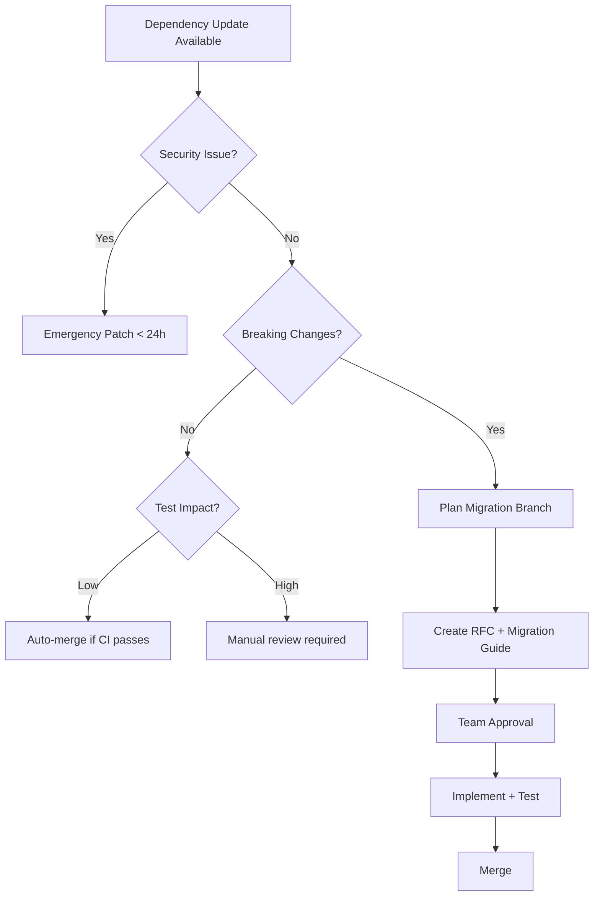

# Dependency Audit & Supply Chain Security

Comprehensive dependency auditing, supply chain security scanning, license compliance enforcement, and version drift detection for enterprise monorepos.

## When to Use This Skill

Use this skill when:

- Auditing dependencies for security vulnerabilities
- Checking license compliance across workspace
- Detecting version drift between packages
- Analyzing transitive dependency risks
- Setting up automated security scanning in CI
- Investigating supply chain attacks
- Creating dependency upgrade strategies
- Monitoring dependency health metrics
- Generating dependency reports for compliance teams

---

## Supply Chain Security

### Threat Model

**Supply Chain Attack Vectors**:

1. **Compromised packages**: Legitimate package hijacked by attacker
2. **Typosquatting**: Similar package names (`lodash` vs `lodas`)
3. **Dependency confusion**: Internal package name conflicts with public registry
4. **Malicious updates**: Maintainer account compromised
5. **Transitive vulnerabilities**: Vulnerability deep in dependency tree

### Security Scanning Tools

#### npm audit / pnpm audit (Built-in)

**Basic usage**:

```bash
# Scan all dependencies
pnpm audit

# Production dependencies only
pnpm audit --prod

# Fail on high severity
pnpm audit --audit-level=high

# Generate JSON report
pnpm audit --json > audit-report.json
```

**CI Integration**:

```yaml
# .github/workflows/security.yml
name: Security Audit

on:
  push:
    branches: [master, main]
  pull_request:
  schedule:
    - cron: "0 0 * * *" # Daily at midnight

jobs:
  audit:
    runs-on: ubuntu-latest
    steps:
      - uses: actions/checkout@v4

      - name: Setup pnpm
        uses: pnpm/action-setup@v4
        with:
          version: 9

      - name: Install dependencies
        run: pnpm install --frozen-lockfile

      - name: Security audit
        run: |
          pnpm audit --prod --audit-level=moderate

      - name: Generate audit report
        if: failure()
        run: pnpm audit --json > audit-report.json

      - name: Upload audit report
        if: failure()
        uses: actions/upload-artifact@v4
        with:
          name: audit-report
          path: audit-report.json
```

**Interpreting Results**:

```bash
# Example output
found 3 vulnerabilities (2 moderate, 1 high) in 1200 packages

Moderate: Denial of Service in lodash
  Dependency of: express > body-parser > @types/body-parser > lodash
  Path: lodash
  More info: https://github.com/advisories/GHSA-xxxx-xxxx-xxxx

High: Remote Code Execution in sharp
  Dependency of: next > sharp
  Path: sharp@0.30.0
  More info: https://github.com/advisories/GHSA-yyyy-yyyy-yyyy
```

**Response Actions**:
| Severity | Example | Action | Timeline |
|----------|---------|--------|----------|
| **Critical** | RCE, Auth bypass | Emergency patch + hotfix | < 24 hours |
| **High** | XSS, SQLi, Data leak | Upgrade in next sprint | < 72 hours |
| **Moderate** | DoS, minor data exposure | Plan upgrade | 1-2 weeks |
| **Low** | Edge case bugs | Quarterly review | Next quarter |

#### Snyk (Advanced Scanning)

**Setup**:

```bash
# Install Snyk CLI
npm install -g snyk

# Authenticate
snyk auth

# Test project
snyk test

# Monitor project (continuous monitoring)
snyk monitor
```

**Features**:

- **Vulnerability database**: More comprehensive than npm audit
- **Fix PRs**: Automatically creates PRs with fixes
- **License scanning**: Checks OSS licenses
- **Container scanning**: Scans Docker images
- **IaC scanning**: Checks Terraform, K8s configs

**CI Integration**:

```yaml
# .github/workflows/snyk.yml
name: Snyk Security Scan

on: [push, pull_request]

jobs:
  security:
    runs-on: ubuntu-latest
    steps:
      - uses: actions/checkout@v4

      - name: Run Snyk to check for vulnerabilities
        uses: snyk/actions/node@master
        env:
          SNYK_TOKEN: ${{ secrets.SNYK_TOKEN }}
        with:
          args: --all-projects --severity-threshold=high
```

**Configuration** (.snyk file):

```yaml
# Ignore specific vulnerabilities (with justification)
ignore:
  "SNYK-JS-LODASH-1018905":
    - "*":
        reason: "Not exploitable in our use case (server-side only)"
        expires: "2026-12-31"

# Patch strategy
patch:
  "SNYK-JS-MINIMIST-559764":
    - yargs > minimist:
        patched: "2024-03-20T00:00:00.000Z"
```

#### Socket.dev (Supply Chain Analysis)

**What it detects**:

- Install scripts (potential malware)
- Network requests (data exfiltration)
- Filesystem access (credential theft)
- Shell execution (backdoors)
- Obfuscated code (hiding malicious behavior)

**Setup**:

```bash
# Install Socket CLI
npm install -g @socketsecurity/cli

# Scan project
socket report view <package-name>

# Check specific package before installing
socket npm info <package-name>
```

**CI Integration**:

```yaml
# .github/workflows/socket.yml
name: Socket Security

on: [pull_request]

jobs:
  socket-security:
    runs-on: ubuntu-latest
    steps:
      - uses: actions/checkout@v4

      - name: Socket Security
        uses: SocketDev/socket-action@v1
        with:
          token: ${{ secrets.SOCKET_TOKEN }}
          issue-comment: true
```

**Example Report**:

```
Package: suspicious-package@1.0.0

🚨 High Risk Issues:
  - Install script detected
  - Network requests to unknown domain
  - Filesystem writes outside project

⚠️  Medium Risk Issues:
  - No maintainer email
  - Recently published (< 6 months)
  - Single maintainer

📊 Metrics:
  - Downloads: 500/week (low trust)
  - Open issues: 23 unresolved
  - Last update: 3 months ago
```

---

## License Compliance

### Checking Licenses

**Command**:

```bash
# List all licenses in workspace
pnpm licenses list

# Generate JSON report
pnpm licenses list --json > licenses.json

# Check for specific license
pnpm licenses list | grep GPL
```

**Tools**:

#### license-checker (npm package)

```bash
npm install -g license-checker

# Generate CSV report
license-checker --csv --out licenses.csv

# Check for problematic licenses
license-checker --onlyAllow "MIT;Apache-2.0;BSD-3-Clause;ISC"

# Fail if disallowed license found
license-checker --failOn "GPL;AGPL;LGPL"
```

#### FOSSA (Enterprise Solution)

- Automated license scanning
- Policy enforcement
- Compliance reports
- Open source attribution

**CI Integration**:

```yaml
# .github/workflows/licenses.yml
name: License Check

on: [push, pull_request]

jobs:
  license-check:
    runs-on: ubuntu-latest
    steps:
      - uses: actions/checkout@v4

      - name: Setup Node
        uses: actions/setup-node@v4
        with:
          node-version: 22

      - name: Install dependencies
        run: pnpm install --frozen-lockfile

      - name: Check licenses
        run: |
          npx license-checker \
            --onlyAllow "MIT;Apache-2.0;BSD-2-Clause;BSD-3-Clause;ISC;0BSD;Unlicense" \
            --failOn "GPL;AGPL;LGPL;SSPL;CC-BY-NC"
```

### License Policy Matrix

| License          | Commercial Use | Modify & Redistribute     | Link as Library | Requires Attribution | Status                 |
| ---------------- | -------------- | ------------------------- | --------------- | -------------------- | ---------------------- |
| **MIT**          | ✅ Yes         | ✅ Yes                    | ✅ Yes          | ⚠️ Optional          | ✅ **Approved**        |
| **Apache-2.0**   | ✅ Yes         | ✅ Yes                    | ✅ Yes          | ✅ Required          | ✅ **Approved**        |
| **BSD-3-Clause** | ✅ Yes         | ✅ Yes                    | ✅ Yes          | ✅ Required          | ✅ **Approved**        |
| **ISC**          | ✅ Yes         | ✅ Yes                    | ✅ Yes          | ⚠️ Optional          | ✅ **Approved**        |
| **GPL-3.0**      | ✅ Yes         | ✅ Yes (must open source) | ❌ Copyleft     | ✅ Required          | ⚠️ **Review Required** |
| **AGPL-3.0**     | ✅ Yes         | ✅ Yes (+ SaaS must open) | ❌ Copyleft     | ✅ Required          | ❌ **Blocked**         |
| **SSPL**         | ⚠️ Limited     | ✅ Yes (+ hosting infra)  | ❌ Copyleft     | ✅ Required          | ❌ **Blocked**         |
| **Proprietary**  | ❌ No          | ❌ No                     | ❌ No           | N/A                  | ❌ **Blocked**         |

**Decision Tree**:

```
Is license on approved list (MIT, Apache, BSD, ISC)?
  ├─ YES → ✅ Auto-approve
  └─ NO → Copyleft license (GPL, AGPL)?
        ├─ YES → ❌ Block (requires legal review)
        └─ NO → Custom license?
              ├─ YES → ⚠️ Manual review required
              └─ NO → Unlicensed?
                    └─ YES → ❌ Block (legal risk)
```

---

## Version Drift Detection

### What is Version Drift?

**Problem**: Different packages using **different versions** of the same dependency.

**Example**:

```
packages/ui/package.json:
  "react": "19.0.0"

packages/admin/package.json:
  "react": "18.2.0"  ← Drift!
```

**Risks**:

- Type conflicts
- Runtime errors
- Duplicate bundles (large bundle size)
- Support burden (tracking which version has which bug)

### Detecting Drift

#### Manual Check

```bash
# List all versions of a package
pnpm list react --depth=Infinity

# Example output showing drift:
packages/ui
├─ react 19.0.0
packages/admin
├─ react 18.2.0  ← DRIFT DETECTED
```

#### Automated Check (manypkg)

```bash
# Install manypkg
pnpm add -Dw @manypkg/cli

# Check for inconsistencies
pnpm exec manypkg check

# Auto-fix inconsistencies
pnpm exec manypkg fix
```

**Output**:

```
❌ Inconsistent versions of "react" found:
   - 19.0.0 in packages/ui
   - 18.2.0 in packages/admin

Fix: Run `pnpm exec manypkg fix` to align versions
```

#### CI Integration

```yaml
# .github/workflows/drift-check.yml
name: Version Drift Check

on: [push, pull_request]

jobs:
  drift-check:
    runs-on: ubuntu-latest
    steps:
      - uses: actions/checkout@v4

      - name: Setup pnpm
        uses: pnpm/action-setup@v4

      - name: Install dependencies
        run: pnpm install --frozen-lockfile

      - name: Check version consistency
        run: pnpm exec manypkg check
```

### Preventing Drift

#### Strategy 1: Workspace Catalogs (pnpm)

```yaml
# pnpm-workspace.yaml
catalog:
  react: 19.0.0  ← Single source of truth

# All package.json files:
{
  "dependencies": {
    "react": "catalog:"  ← Always resolves to catalog version
  }
}
```

#### Strategy 2: Overrides (pnpm/npm/yarn)

```json
// package.json (workspace root)
{
  "pnpm": {
    "overrides": {
      "react": "19.0.0" // Force all packages to use this version
    }
  }
}
```

#### Strategy 3: Resolutions (yarn/npm)

```json
// package.json (workspace root)
{
  "resolutions": {
    "react": "19.0.0"
  }
}
```

---

## Transitive Dependency Analysis

### Understanding Dependency Trees

**Direct vs Transitive**:

```
Your package.json:
  express (direct dependency)
    ├─ body-parser (transitive)
    │  └─ bytes (transitive)
    ├─ cookie (transitive)
    └─ path-to-regexp (transitive)
```

**Problem**: Vulnerabilities in transitive deps are **harder to fix** (you don't control the version).

### Analyzing Transitive Dependencies

```bash
# Show why a package is installed
pnpm why <package-name>

# Example:
pnpm why lodash

# Output:
packages/ui
└─ react-admin 4.0.0
   └─ lodash 4.17.20  ← Transitive dep

packages/api
└─ express 4.18.0
   └─ body-parser 1.20.0
      └─ lodash 4.17.20  ← Same transitive dep
```

**Visualizing the tree**:

```bash
# Full dependency tree
pnpm list --depth=Infinity

# Tree for specific package
pnpm list <package-name> --depth=Infinity

# Visualize with graph
pnpm exec @pnpm/deps-tree <package-path>
```

### Fixing Transitive Vulnerabilities

#### Option 1: Upgrade Parent Package

```bash
# If express depends on vulnerable lodash:
pnpm update express --latest

# Check if it fixed the issue
pnpm audit
```

#### Option 2: Override Transitive Version

```json
// package.json (workspace root)
{
  "pnpm": {
    "overrides": {
      "lodash": "4.17.21" // Force safe version everywhere
    }
  }
}
```

#### Option 3: Patch Package

```bash
# Install patch-package
pnpm add -Dw patch-package

# Make changes to node_modules/<package>
# Then:
npx patch-package <package-name>

# Creates patches/<package-name>+<version>.patch
# Auto-applied on pnpm install
```

**package.json**:

```json
{
  "scripts": {
    "postinstall": "patch-package"
  }
}
```

---

## Dependency Health Metrics

### What to Monitor

| Metric                  | Good       | Warning     | Bad                     |
| ----------------------- | ---------- | ----------- | ----------------------- |
| **Last Update**         | < 3 months | 3-12 months | > 1 year                |
| **Open Issues**         | < 50       | 50-200      | > 200                   |
| **Issue Response Time** | < 7 days   | 7-30 days   | > 30 days               |
| **Weekly Downloads**    | > 100K     | 10K-100K    | < 10K                   |
| **Contributors**        | > 10       | 3-10        | 1-2 (single maintainer) |
| **Test Coverage**       | > 80%      | 50-80%      | < 50%                   |
| **Documentation**       | Extensive  | Basic       | None                    |

### Checking Health

#### npm trends

```bash
# Visit: https://www.npmtrends.com/<package-name>
# Shows: downloads, stars, issues, PRs over time
```

#### npms.io (API)

```bash
# Get package score
curl https://api.npms.io/v2/package/<package-name>

# Example response:
{
  "score": {
    "final": 0.89,
    "detail": {
      "quality": 0.92,
      "popularity": 0.88,
      "maintenance": 0.87
    }
  }
}
```

#### Socket.dev Score

```bash
socket npm info <package-name>

# Output:
Package: express@4.18.0
Socket Score: 89/100

Quality:
  ✅ Well maintained
  ✅ Active development
  ✅ Good test coverage

Security:
  ✅ No vulnerabilities
  ⚠️  Many transitive deps (watch for supply chain risk)

Popularity:
  ✅ 20M+ weekly downloads
  ✅ 50K+ dependents
```

---

## Automated Dependency Updates

### Dependabot (GitHub)

**Config** (.github/dependabot.yml):

```yaml
version: 2
updates:
  # Workspace root
  - package-ecosystem: "npm"
    directory: "/"
    schedule:
      interval: "weekly"
      day: "monday"
      time: "09:00"
    open-pull-requests-limit: 5
    labels:
      - "dependencies"
      - "automated"

    # Security updates only
    # open-pull-requests-limit: 10
    # target-branch: "main"

    # Grouping (reduce PR spam)
    groups:
      development-dependencies:
        dependency-type: "development"
        update-types:
          - "minor"
          - "patch"

      production-dependencies:
        dependency-type: "production"
        update-types:
          - "patch" # Only auto-update patches for prod deps

    # Ignore specific packages
    ignore:
      - dependency-name: "react"
        update-types: ["version-update:semver-major"] # Don't auto-upgrade React majors

  # Individual packages
  - package-ecosystem: "npm"
    directory: "/apps/api"
    schedule:
      interval: "weekly"

  - package-ecosystem: "npm"
    directory: "/apps/web"
    schedule:
      interval: "weekly"
```

**PR Auto-Merge**:

```yaml
# .github/workflows/auto-merge-dependabot.yml
name: Auto-merge Dependabot PRs

on:
  pull_request:
    types: [opened, synchronize]

jobs:
  auto-merge:
    runs-on: ubuntu-latest
    if: github.actor == 'dependabot[bot]'
    steps:
      - name: Dependabot metadata
        id: metadata
        uses: dependabot/fetch-metadata@v2

      - name: Auto-merge patch updates
        if: steps.metadata.outputs.update-type == 'version-update:semver-patch'
        run: gh pr merge --auto --squash "$PR_URL"
        env:
          PR_URL: ${{ github.event.pull_request.html_url }}
          GITHUB_TOKEN: ${{ secrets.GITHUB_TOKEN }}
```

### Renovate Bot (Alternative)

**Features**:

- More customizable than Dependabot
- Monorepo-aware
- Can group updates by package
- Automerging

**Config** (renovate.json):

```json
{
  "$schema": "https://docs.renovatebot.com/renovate-schema.json",
  "extends": ["config:base", ":preserveSemverRanges"],
  "schedule": ["before 5am on monday"],
  "timezone": "America/New_York",

  "packageRules": [
    {
      "matchUpdateTypes": ["patch"],
      "matchDepTypes": ["devDependencies"],
      "automerge": true
    },
    {
      "matchPackagePatterns": ["^@types/"],
      "groupName": "Type definitions",
      "automerge": true
    },
    {
      "matchPackagePatterns": ["^eslint", "^@typescript-eslint"],
      "groupName": "ESLint",
      "schedule": ["before 5am on the first day of the month"]
    }
  ],

  "vulnerabilityAlerts": {
    "enabled": true,
    "labels": ["security"],
    "automerge": true,
    "schedule": ["at any time"]
  }
}
```

---

## Dependency Upgrade Strategy

### Prioritization Framework

**Tier 1 (Upgrade Immediately)**:

- Security vulnerabilities (high/critical)
- Bug fixes affecting production
- Performance improvements > 20%

**Tier 2 (Plan in Sprint)**:

- Minor version updates with new features
- Dependency requested by feature team
- Ecosystem compatibility (e.g., Next.js tooling)

**Tier 3 (Quarterly Review)**:

- Major version updates (breaking changes)
- Framework/platform migrations
- Deprecated packages needing replacement

**Tier 4 (Defer)**:

- Cosmetic changes
- Ecosystem still stabilizing
- Low-value updates

### Upgrade Workflow



---

## Key Takeaways

1. **Automate Security Scanning**: CI integration for npm audit, Snyk, Socket.dev
2. **Enforce License Compliance**: Block incompatible licenses in CI
3. **Prevent Version Drift**: Use workspace catalogs + manypkg checks
4. **Monitor Transitive Deps**: Use `pnpm why` to understand dependency trees
5. **Track Dependency Health**: Monitor update frequency, issue response, maintainer activity
6. **Automate Updates**: Dependabot/Renovate for patches, manual review for majors
7. **Prioritize Upgrades**: Security first, then features, then cosmetic changes

---

## CI Pipeline Example

```yaml
# .github/workflows/dependency-audit.yml
name: Comprehensive Dependency Audit

on:
  push:
    branches: [master, main]
  pull_request:
  schedule:
    - cron: "0 9 * * 1" # Weekly on Monday at 9am

jobs:
  security-audit:
    name: Security Audit
    runs-on: ubuntu-latest
    steps:
      - uses: actions/checkout@v4
      - uses: pnpm/action-setup@v4
      - uses: actions/setup-node@v4
        with:
          node-version: 22
          cache: "pnpm"

      - name: Install dependencies
        run: pnpm install --frozen-lockfile

      - name: npm audit
        run: pnpm audit --audit-level=moderate

      - name: Snyk scan
        uses: snyk/actions/node@master
        env:
          SNYK_TOKEN: ${{ secrets.SNYK_TOKEN }}
        with:
          args: --severity-threshold=high

  license-check:
    name: License Compliance
    runs-on: ubuntu-latest
    steps:
      - uses: actions/checkout@v4
      - uses: actions/setup-node@v4
      - run: npm install -g license-checker
      - run: |
          license-checker \
            --onlyAllow "MIT;Apache-2.0;BSD-2-Clause;BSD-3-Clause;ISC" \
            --failOn "GPL;AGPL;SSPL"

  version-drift:
    name: Version Drift Check
    runs-on: ubuntu-latest
    steps:
      - uses: actions/checkout@v4
      - uses: pnpm/action-setup@v4
      - run: pnpm install --frozen-lockfile
      - run: pnpm exec manypkg check

  dependency-health:
    name: Dependency Health Report
    runs-on: ubuntu-latest
    if: github.event_name == 'schedule'
    steps:
      - uses: actions/checkout@v4
      - uses: pnpm/action-setup@v4
      - run: pnpm outdated > outdated-report.txt || true
      - run: pnpm audit --json > audit-report.json || true
      - uses: actions/upload-artifact@v4
        with:
          name: dependency-reports
          path: |
            outdated-report.txt
            audit-report.json
```

---

## Related Skills

- **monorepo-governance**: Dependency admission rules, versioning strategy
- **monorepo-workflows**: CI/CD patterns, automated testing
- **pnpm**: Workspace protocol, overrides, auditing commands
- **turborepo**: Task caching, affected detection
