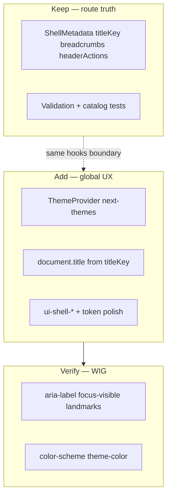

# App shell: design system + Web Interface Guidelines — completion plan

## Reframe: rubbish, over-engineer, or layered on purpose?

**Not rubbish.** The authenticated shell under [`apps/web/src/app/_platform/shell/`](apps/web/src/app/_platform/shell/) is **platform infrastructure**: contracts, validation reports, resolution traces, and policy-driven nav exist so **many routes and CI** stay aligned at ERP scale. That is real complexity with a real payoff (fewer silent breadcrumb/title drift bugs).

**Where the frustration comes from** is usually **product chrome polish**, not the contracts: no global `ThemeProvider`, no tab title sync, header rows that are structurally correct but visually “template-y,” and tokens/CSS that are correct but not yet wrapped in **semantic `ui-shell-*` utilities**. That gap reads as “empty shell,” not as proof that metadata governance should be deleted.

**Over-engineering** would mean _adding more_ route metadata for things that are **user-global** (theme, density) or _duplicating_ `useMatches` in every component. The optimization is: **keep contracts for route-driven chrome**; **add app-root providers and DS-level styling** for global UX.

## Creative completion (what “finished shell” means here)

1. **Global theme is real** — Users can switch light/dark/system; `<html>` class + `localStorage` stay in sync with [`apps/web/index.html`](apps/web/index.html) blocking script; React and any `useTheme()` consumers (e.g. design-system Sonner) share one context.
2. **Chrome looks intentional** — Header/sidebar use **semantic Tailwind utilities** (`ui-shell-*` or approved `ui-*`) from a **single** [`apps/web/src/index.css`](apps/web/src/index.css) location, matching [`docs/COMPONENTS_AND_STYLING.md`](docs/COMPONENTS_AND_STYLING.md).
3. **Tab title matches shell** — `document.title` derives from resolved `titleKey` (see existing direction in [`.cursor/plans/shell-chrome-refactor.plan.md`](.cursor/plans/shell-chrome-refactor.plan.md)).
4. **Guidelines-backed** — Icon-only theme control has **`aria-label`**; focus rings are visible; **`prefers-reduced-motion`** respected (already partly in base CSS); **`color-scheme`** on `html` tracks light/dark (extend if needed after ThemeProvider).

## Workstream A — Tailwind v4 + design system optimization

| Action                  | Detail                                                                                                                                                                                                                                                                                                              |
| ----------------------- | ------------------------------------------------------------------------------------------------------------------------------------------------------------------------------------------------------------------------------------------------------------------------------------------------------------------- |
| **Canonical utilities** | Add `@utility` entries for shell chrome (header strip, sidebar density, optional `line-t` borders) in [`apps/web/src/index.css`](apps/web/src/index.css); reuse patterns from [`packages/design-system/design-architecture/src/local.css`](packages/design-system/design-architecture/src/local.css) where aligned. |
| **Token discipline**    | No raw palette in shell components; semantic tokens only (`bg-background`, `border-border`, `text-muted-foreground`).                                                                                                                                                                                               |
| **Dark variant**        | Already uses `@custom-variant dark (&:where(.dark, .dark *))`; ensure ThemeProvider toggles **`class`** on `document.documentElement` consistent with Tailwind skill.                                                                                                                                               |
| **Landing + /app**      | Marketing `/` and `/app/*` should both inherit the same root theme — ThemeProvider wraps **entire** app in [`App.tsx`](apps/web/src/App.tsx), not only `AppShellLayout`.                                                                                                                                            |

## Workstream B — Web Interface Guidelines (WIG) checklist for shell

Source: Vercel Web Interface Guidelines (`command.md` rules). Map to shell touchpoints:

| WIG theme               | Shell application                                                                                                                                |
| ----------------------- | ------------------------------------------------------------------------------------------------------------------------------------------------ |
| **Accessibility**       | Theme toggle: `aria-label` + keyboard; breadcrumb/header use semantic structure; preserve `SidebarTrigger` affordances.                          |
| **Focus**               | Use existing `focus-ring` / DS focus-visible; no `outline-none` without replacement.                                                             |
| **Dark mode & theming** | `color-scheme` on `html`; align `meta name="theme-color"` with resolved theme where product wants mobile browser chrome (optional small effect). |
| **Animation**           | Respect `prefers-reduced-motion` (base layer already reduces motion).                                                                            |
| **Typography**          | Loading strings use `…` where applicable; shell strings via i18n.                                                                                |

Run a short **manual pass** on [`AppShellHeader`](apps/web/src/app/_platform/shell/components/app-shell-header.tsx), [`AppShellSidebar`](apps/web/src/app/_platform/shell/components/app-shell-sidebar.tsx), and new theme control against the list above.

## Workstream C — Implementation notes (when executing)

1. **Dependency** — [`next-themes`](https://github.com/pacocoursey/next-themes) is not listed in [`apps/web/package.json`](apps/web/package.json); add to `@afenda/web` (workspace aligns with [`packages/design-system/package.json`](packages/design-system/package.json) version).
2. **ThemeProvider** — `attribute="class"`, `storageKey="vite-ui-theme"`, `defaultTheme` aligned with inline script default (`"dark"` today vs `"system"` — pick one and **update both** script + provider to avoid FOUC confusion).
3. **Placement** — `ThemeToggle` in header next to [`LanguageSwitcher`](apps/web/src/app/_platform/i18n/components/language-switcher.tsx); **not** a new `ShellMetadata` field.
4. **Do not** — Remove shell governance tests, flatten contracts, or put `theme` on `handle.shell`.

## Verification

- `pnpm --filter @afenda/web run lint` / `typecheck` / `test:run` (shell tests).
- Manual: `/` and `/app/events` — theme persists reload; no flash mismatch; keyboard + screen reader on toggle.
- Optional: add a **single** RTL or a11y test for the toggle if the repo pattern supports it.

## Relationship to other plans

- Extends [`.cursor/plans/shell-chrome-refactor.plan.md`](.cursor/plans/shell-chrome-refactor.plan.md) (document title + `ui-shell-*`).
- Supersedes the narrow “theme vs metadata only” discussion with a **full chrome completion** scope.

## Out of scope (this round)

- Rewriting shell policy or navigation matrix without product input.
- New `ShellMetadata` fields for theme or layout density.
- Full marketing redesign of `/` (only ensure theme inheritance).
