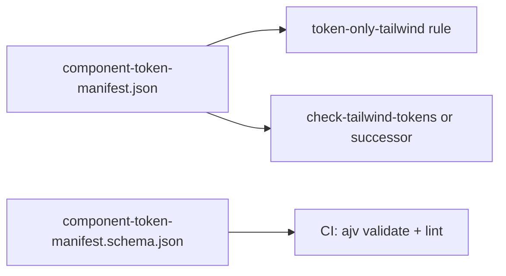

# Automation metadata manifest (replaces hardcoded ESLint patterns)

## Problem

Today, governed Tailwind rules live as **hardcoded arrays** in [packages/eslint-config/src/rules/token-only-tailwind.js](packages/eslint-config/src/rules/token-only-tailwind.js) (`ALLOWED_PREFIXES`, `FORBIDDEN_PATTERNS`, `PALETTE_FORBIDDEN_PATTERNS`) and partially duplicate [packages/design-system/scripts/check-tailwind-tokens.ts](packages/design-system/scripts/check-tailwind-tokens.ts). Changing policy requires editing JS and risks drift from [TOKEN_COMPONENT_CONTRACT.md](packages/design-system/design-architecture/TOKEN_COMPONENT_CONTRACT.md).

## Solution overview

Introduce a **single machine-readable manifest** (JSON + JSON Schema) as the **source of truth** for automation metadata. ESLint and any grep-style scripts **load or codegen from this file** instead of embedding regex arrays in source.



---

## 1. Artifact locations (proposed)

| Artifact | Path |
| --- | --- |
| Manifest (data) | `packages/design-system/design-architecture/component-token-manifest.json` |
| JSON Schema | `packages/design-system/design-architecture/component-token-manifest.schema.json` |
| Contract (human) | [TOKEN_COMPONENT_CONTRACT.md](packages/design-system/design-architecture/TOKEN_COMPONENT_CONTRACT.md) — **references** manifest `version` / sections; prose stays authoritative for intent |

---

## 2. Manifest shape (minimal but complete)

Manifest is **regex-oriented** to match current ESLint behavior (string patterns serialized as JSON-safe regex strings).

```json
{
  "$schema": "./component-token-manifest.schema.json",
  "version": "1.0.0",
  "contractDocument": "TOKEN_COMPONENT_CONTRACT.md",
  "global": {
    "allowedTailwindClassPatterns": [
      "^bg-(background|card|...)$",
      "^text-(foreground|...)$"
    ],
    "forbiddenTailwindClassPatterns": [
      "\\bp-\\d+",
      "\\btext-(xs|sm|base|lg|xl|\\d)"
    ],
    "paletteDriftPatterns": [
      "bg-\\w+-\\d+",
      "text-\\w+-\\d+"
    ]
  },
  "rulesets": {
    "strict": {
      "description": "ui-primitives: full allowlist + full forbidden",
      "usePaletteDriftOnly": false
    },
    "driftOnly": {
      "description": "app shell layers: palette scale drift only",
      "usePaletteDriftOnly": true
    },
    "demo": {
      "description": "marketing token playground — optional wider allowlist",
      "extends": "strict",
      "additionalAllowedPatterns": [],
      "inlineStyleAllowed": true
    }
  },
  "targets": [
    {
      "id": "ui-primitives",
      "globs": ["packages/design-system/ui-primitives/**/*.tsx"],
      "ruleset": "strict"
    },
    {
      "id": "apps-web-features",
      "globs": ["apps/web/src/**/*.tsx"],
      "ruleset": "driftOnly"
    }
  ]
}
```

**Notes:**

- `allowedTailwindClassPatterns`: replaces `ALLOWED_PREFIXES` — each string compiles to `new RegExp(pattern)` (document in schema whether anchors are required).
- `forbiddenTailwindClassPatterns` + `paletteDriftPatterns`: replace `FORBIDDEN_PATTERNS` and `PALETTE_FORBIDDEN_PATTERNS`.
- `rulesets` maps to existing ESLint option `driftOnly` and future per-folder overrides.
- `targets` lets CI and docs list **which globs** use which profile without duplicating in eslint flat config (optional phase 2: eslint config generator reads `targets`).

---

## 3. Consumption strategies (pick one primary)

### Option A — ESLint rule loads manifest at runtime (recommended for iteration speed)

- Resolve path to `component-token-manifest.json` relative to `@afenda/eslint-config` package root or monorepo root (`path.join` from `import.meta.url` or `require.resolve`).
- In `create()`, `readFileSync` + `JSON.parse`, compile regex strings once, reuse current logic (`isAllowed` / `isForbidden`).
- **Pros:** No codegen step; edit manifest → rerun eslint.
- **Cons:** Slightly slower ESLint startup; must handle missing file with clear error.

### Option B — Codegen before lint/CI

- Script `packages/design-system/design-architecture/scripts/emit-token-tailwind-data.mjs` reads manifest → writes `packages/eslint-config/src/generated/token-tailwind-data.js` exporting `{ allowed, forbidden, paletteDrift }` as precompiled `RegExp[]`.
- ESLint rule imports `./generated/token-tailwind-data.js`.
- **Pros:** Fast ESLint; manifest still SSOT; generated file can be snapshot-tested.
- **Cons:** Must run codegen when manifest changes (add to `pnpm run check` / prelint).

### Option C — Hybrid

- Manifest in repo; CI runs codegen + fails if generated file differs from committed file (same pattern as theme drift checks).

**Recommendation:** Start with **A** for simplicity; move to **B** or **C** if ESLint cold-start cost matters at scale.

---

## 4. Deprecating hardcoded duplicates

1. **Migrate v1:** Copy existing regexes from `token-only-tailwind.js` into manifest JSON verbatim; add a one-time test that manifest-driven logic reports the same violations on a fixture file set.
2. **Remove** duplicated `FORBIDDEN` from `check-tailwind-tokens.ts` — replace with `import` of same manifest or call shared `validateTailwindClasses(source, rulesetId)` from a small `packages/design-system/src/token-manifest/` module.
3. **Document** in TOKEN_COMPONENT_CONTRACT §11/§13: “Automation metadata: `component-token-manifest.json` (version X).”

---

## 5. CI gates

| Check | Purpose |
| --- | --- |
| `ajv -s component-token-manifest.schema.json -d component-token-manifest.json` | Schema validity |
| ESLint (manifest-backed rule) | Policy enforcement |
| Optional: `manifest.version` must match changelog row in TOKEN_COMPONENT_CONTRACT | Human + machine version alignment |

---

## 6. Per-component metadata (future extension)

The same manifest can gain a `components[]` array without breaking global keys:

```json
"components": [
  {
    "id": "button",
    "contractSections": ["§1"],
    "globs": ["**/ui-primitives/**/button*.tsx"],
    "ruleset": "strict",
    "notes": "height via --size-control-*"
  }
]
```

Automation can then **scope** stricter rules by file glob. ESLint `overrides` in flat config can still be generated from `components[]` in a follow-up.

---

## 7. Per-component manifest: colocated TypeScript vs. central JSON

**Question:** Should governance metadata look like the user’s **JSDoc + `as const` object** (e.g. `buttonManifest` next to `Button`), or live only in **JSON**?

| Concern | Central JSON (`component-token-manifest.json`) | Colocated TS (`button.manifest.ts` or inline `export const buttonManifest`) |
| --- | --- | --- |
| **Global Tailwind regex allow/forbid** | **Best fit** — no import cycle; ESLint package can `readFile` JSON without depending on `ui-primitives` | Possible via shared package, but awkward for eslint-config to import TS from design-system |
| **Variants / sizes / states** | Easy to drift from real implementation ([`button.tsx`](packages/design-system/ui-primitives/button.tsx) already defines truth in **`cva` / `buttonVariants`**) | **TS colocated** can be type-checked; better if **derived**, not duplicated |
| **Fixtures, a11y, lifecycle, CI coverage** | Valid in JSON | **TS colocated** is nicer: `as const`, JSDoc `@manifest`, tests import same object |
| **Schema validation** | JSON Schema + `ajv` | **Zod** or `satisfies` + `satisfies` a shared `ComponentManifest` type |

### Recommended hybrid (avoids “double truth”)

1. **Keep global token/Tailwind automation in JSON** (section 2) — one file for **regex policy** consumed by ESLint/scripts.
2. **Per-primitive component** metadata in **TypeScript**, colocated or in a sibling file:
   - Example: `packages/design-system/ui-primitives/button.manifest.ts` exporting `buttonManifest` **or** a single `packages/design-system/ui-primitives/manifests/index.ts` that re-exports per component.
3. **Do not hand-list `variants` / `sizes` if they duplicate CVA** — today [`button.tsx`](packages/design-system/ui-primitives/button.tsx) already defines `variant` and `size` in `buttonVariants`. Options:
   - **A (preferred):** Manifest only carries **non-duplicate** fields: `lifecycle`, `fixtures`, `a11y`, `contractSection`; CI/tests **infer** allowed variants via `VariantProps<typeof buttonVariants>` or a small exported `buttonVariantKeys` derived once from the same object as `cva`.
   - **B:** Codegen `variants` array from a shared `const buttonVariantDef = { ... }` passed to both `cva()` and manifest export (single SSOT).
   - **C:** Accept duplication only if guarded by a **test** that manifest keys match `Object.keys(buttonVariants.variants.variant)`.

4. **JSDoc block** (`@manifest Button`, `@purpose`) — fine for human/docs; optional **typedoc** or **eslint-plugin** to require the block on exported manifests is a later step.

### When JSON-only for a component makes sense

- Consumed by **non-TS** tools (Storybook JSON, external design tools).
- Then **generate** JSON from TS in CI (`emit: manifest` → `dist/button.manifest.json`) so **TS remains SSOT**.

---

## 8. Implementation order (execution checklist — do not run until approved)

1. Add `component-token-manifest.schema.json` + initial `component-token-manifest.json` (parity with current JS arrays).
2. Refactor `token-only-tailwind.js` to load patterns from manifest (Option A).
3. Add AJV validation script + root `package.json` check script entry.
4. Align or replace `check-tailwind-tokens.ts` to use manifest.
5. Update TOKEN_COMPONENT_CONTRACT with pointer + drift taxonomy table.
6. (Optional) Add `components[]` in **JSON** only for glob → ruleset mapping; **per-component** governance (fixtures, a11y, lifecycle) in **colocated TS** per section 7, with **no duplicate variant lists** vs. CVA without a guard test or shared SSOT.
7. (Optional) Codegen for eslint overrides from `targets` / `components[]`.

---

## Changelog

| Date | Change |
| --- | --- |
| 2026-04-14 | Plan: automation metadata manifest replaces hardcoded ESLint token arrays. |
| 2026-04-14 | Section 7: TS colocated vs JSON — hybrid; align with CVA in `button.tsx`; avoid duplicate variant keys. |
