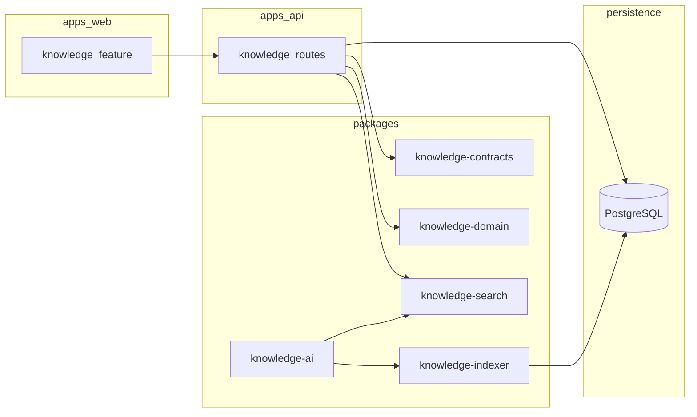

# Afenda Omni Notes — Governed Knowledge Engine (revised)

## Positioning (product truth)

Build **Afenda Notes as a governed knowledge engine**, not “another Notion clone.”

**Afenda Omni Notes = governed team knowledge base + cited AI memory + operational truth records.**

- Not personal note-taking first
- Not whiteboard first
- Not task management first
- **Team-governed knowledge, searchable truth, citations, auditability, future AI memory**

Sharpen the stack metaphor:

> **Outline + Logseq + Khoj** — not **Notion + Obsidian + whiteboard**.

| Pattern                        | Examples (OpenAlternative category) | What to learn                                                    |
| ------------------------------ | ----------------------------------- | ---------------------------------------------------------------- |
| All-in-one workspace           | Affine, AppFlowy                    | Rich editor + tasks + whiteboard — **bloat risk**; avoid for MVP |
| **Team wiki** (best early fit) | Outline, Docmost, XWiki             | Permissions, history, collaboration                              |
| **PKM / graph**                | Logseq, SiYuan, AnyType             | Backlinks, block references, relations                           |
| **Private notes**              | Joplin, Notesnook, Standard Notes   | E2EE/offline — **not MVP core**; posture only                    |
| **AI knowledge**               | Khoj, Open-Notebook, SurfSense      | Cited Q&A, hybrid search — **after** lexical search is solid     |

Reference: [Open Source Note Taking & Knowledge Management (OpenAlternative)](https://openalternative.co/categories/productivity-utilities/note-taking-knowledge-management)

## Module and package names

Use **`@afenda/knowledge`** as the product/module identity (value is **captured business truth**, not “notes” as a label).

| Package                       | Role                                                         |
| ----------------------------- | ------------------------------------------------------------ |
| `@afenda/knowledge-contracts` | Zod/TS request-response and shared domain types              |
| `@afenda/knowledge-domain`    | Pure rules, invariants, non-framework logic                  |
| `@afenda/knowledge-search`    | Lexical (Phase 1–2) + interface for hybrid later             |
| `@afenda/knowledge-indexer`   | Chunking, embeddings pipeline, index maintenance (Phase 2–3) |
| `@afenda/knowledge-ai`        | RAG / cited Q&A orchestration, provider-agnostic (Phase 3)   |

**Code layout**

- `apps/web/src/features/knowledge/`
- `apps/api/src/knowledge/`

## Chosen technical baseline (unchanged, aligned with monorepo)

- [`apps/web`](apps/web) (Vite + React) + [`apps/api`](apps/api) (Hono) + PostgreSQL via [`packages/_database`](packages/_database)
- Team-first: server-indexable data for collaboration and future AI; **full E2EE workspace deferred** (ADR-scoped)
- **Do not build yet**: full Notion DB clone, whiteboard/canvas, CRDT real-time coediting, public plugin marketplace, heavy PM suite, full E2EE workspace

## MVP — copy the “right 20%”

**Adopt now (Phase 1)**

- From **Outline / Docmost**: team workspace, permissions, document tree, editor, history (minimal first)
- From **Logseq / SiYuan** (subset): backlinks, block references, daily notes
- **Lexical / full-text search** before any semantic/AI
- Tenant ownership, **audit events**, **RBAC**

**Phase 2 — Team Reliability**

- Comments, mentions, revision history, document activity stream
- Sharing rules, attachment indexing, search quality metrics

**Phase 3 — Truth Intelligence** (after indexer foundation)

- From **Khoj / Open-Notebook** (pattern): **semantic search + cited Q&A** with source references
- Typed relations, entity extraction, workflow/plugin **alpha** (bounded)

## DoD (definition of “better”)

- **Positioning DoD**: No shipped surface positions Afenda as generic Notion; docs and ADR use “governed knowledge / truth / audit / citations.”
- **Product DoD**: Inbox + editor + tree + tags + backlinks + full-text search + RBAC + audit are measurable (capture latency, search success, DAU/WAU on knowledge).
- **Engineering DoD**: Repo quality gates (format, lint, typecheck, test, build) pass; API route contract + generated route surface; tenant isolation tests.
- **Governance DoD**: ADR records triggers for E2EE/CRDT/DB-features; ATC binds boundaries to checks + evidence; no unenforced `enforced` claims.

## ADR and ATC (documentation)

- New **ADR**: `@afenda/knowledge` product doctrine, team-wiki+PKM layer, anti-bloat and deferral of Affine-style scope; migration triggers for privacy/CRDT.
- New **ATC**: enforceable ownership (`apps/api` route truth, `packages/knowledge-*` import rules, audit/event requirements) with real commands and artifacts under [`docs/architecture/`](docs/architecture/).
- Follow [`docs/ARCHITECTURE_EVOLUTION.md`](docs/ARCHITECTURE_EVOLUTION.md) for measurable triggers and blast radius.

## 90-day phasing (summary)

1. **Phase 1 — Knowledge Foundation**: See MVP list above; PostgreSQL + audit + RBAC.
2. **Phase 2 — Team Reliability**: See Phase 2 list above.
3. **Phase 3 — Truth Intelligence**: Indexer + AI packages; semantic + cited Q&A; relations + entity extraction; plugin alpha.

## Diagram (boundaries)

## Prior plan supersession

This document **supersedes** the earlier “omni notes” plan naming (`notes-contracts` / `notes-*`). Use `@afenda/knowledge` and `knowledge-*` packages throughout new work.
