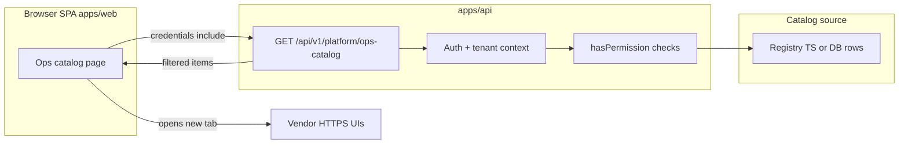

# External dependencies portal — architecture (idea)

**Status:** idea / planned — not implemented. Use this document as the canonical sketch before building.

**Goal:** Give DevOps and platform owners **one in-app place** to discover **external services** (Better Auth Infra, Neon, Tolgee, Vercel, tunnels, etc.), open **vendor login/dashboard URLs** quickly, and read **non-secret remarks** (runbook, owners, rotation notes). **Secrets stay protected** and are **not** listed in plain text in the UI.

This deliberately **does not** embed third-party dashboards in iframes (most vendors block it). “Embedding” means **curated deep links** + **RBAC**, not iframes.

---

## 1. Principles

1. **Server is source of truth for authorization** — same rule as [`docs/ROLES_AND_PERMISSIONS.md`](../ROLES_AND_PERMISSIONS.md): the browser may hide nav for UX; **every sensitive read goes through the API** with `hasPermission` (or equivalent).
2. **No secrets in catalog payloads** — API responses contain **URLs, labels, remarks, env var _names_** only. Values (API keys, connection strings) live in **host env**, **secret manager**, or a future **encrypted store** — never returned as bulk JSON to the client.
3. **Simple RBAC first** — a small set of stable permission keys (see §4). Avoid dozens of per-vendor keys until needed.
4. **Same patterns as the shell** — reuse [`ShellNavigationItem.permissionKeys`](../SHELL_ARCHITECTURE.md) / `filterShellNavigationItems` for **nav visibility**; reuse session/cookie auth already used by `apps/api`.

---

## 2. Conceptual architecture

- **Registry:** Phase A — **read-only TypeScript module** in-repo (URLs + permission keys + remarks). Phase B — **DB-backed** rows for edits without deploy (still no raw secrets in columns unless encrypted + separate story).
- **External systems:** Only **HTTPS links**; user completes MFA on the vendor side.

---

## 3. Data layers (what may appear in the UI)

| Layer                       | Examples                                                                                                  | In portal?                                                                                       |
| --------------------------- | --------------------------------------------------------------------------------------------------------- | ------------------------------------------------------------------------------------------------ |
| **A — Link & metadata**     | Vendor name, dashboard URL, docs link, related `.env` **names** from [`.env.example`](../../.env.example) | Yes, if `hasPermission`                                                                          |
| **B — Operational remarks** | Owner team, escalation, “rotate key Q2”, link to internal runbook                                         | Yes, with same or stricter permission                                                            |
| **C — Secrets**             | API keys, DB passwords, tokens                                                                            | **No** bulk display; vault / env only; optional future “reveal” with audit (out of scope for v1) |

---

## 4. Permission keys (illustrative — register in canon when implemented)

Keep the first iteration to **two** keys:

| Key                            | Purpose                                             |
| ------------------------------ | --------------------------------------------------- |
| `platform:integrations:view`   | View ops catalog and open external links.           |
| `platform:integrations:manage` | Edit catalog entries (when DB-backed admin exists). |

**Tenant vs platform:** Decide whether this catalog is **global** (single tenant “platform”) or **per tenant**. The doc [`docs/ROLES_AND_PERMISSIONS.md`](../ROLES_AND_PERMISSIONS.md) applies either way: evaluate in **tenant context** (or explicit platform tenant).

Shell nav entry for the page should set `permissionKeys: ["platform:integrations:view"]` so empty/default permission stubs do not accidentally expose the route — align with [`filterShellNavigationItems`](../../apps/web/src/app/_platform/shell/services/filter-shell-navigation-items.ts) behavior.

---

## 5. API sketch (future)

- **`GET /api/v1/platform/ops-catalog`**
  - Requires authenticated session + `platform:integrations:view`.
  - Returns `{ items: Array<{ id, label, href, remark, envVarNames?: string[] }> }` — **no secrets**.

Optional later:

- **`GET /api/v1/platform/ops-catalog/status`** — boolean “configured?” per env **name** (derived from server env presence). **High sensitivity** — can leak environment shape; gate with a **separate** permission or omit in v1.

---

## 6. UI sketch (future)

- **Route:** e.g. `/app/platform/integrations` (exact path TBD when implemented).
- **Guard:** `RequireAuth` + **server-backed** permission (not client-only role enums).
- **Layout:** Card per integration — **title**, **“Open dashboard”** (external `target="_blank"` `rel="noopener noreferrer"`), **remark** markdown or plain text (sanitized).
- **No iframes** for vendor dashboards by default.

---

## 7. Phased delivery

| Phase  | Scope                                                                                   |
| ------ | --------------------------------------------------------------------------------------- |
| **P0** | Architecture + permission keys registered in docs; no code.                             |
| **P1** | Registry module + API + read-only page + shell nav behind `platform:integrations:view`. |
| **P2** | Persist catalog in DB + `platform:integrations:manage` admin UI.                        |
| **P3** | Optional encrypted secret references + audit (only if product requires in-app secrets). |

---

## 8. Related docs

- [`docs/ROLES_AND_PERMISSIONS.md`](../ROLES_AND_PERMISSIONS.md) — RBAC + PBAC model.
- [`docs/INTEGRATIONS.md`](../INTEGRATIONS.md) — third-party integrations overview.
- [`docs/PROJECT_CONFIGURATION.md`](../PROJECT_CONFIGURATION.md) — env conventions.
- [`apps/api/src/app.ts`](../../apps/api/src/app.ts) — Better Auth mounted at `/api/auth/*` (context for “auth-related” links).

---

## 9. Non-goals (v1)

- Iframe **embedding** of vendor UIs.
- Storing **plaintext secrets** in the catalog API.
- Replacing **1Password / cloud secret managers** for credential storage (portal complements them).

---

_Last updated: idea draft for Afenda monorepo._
