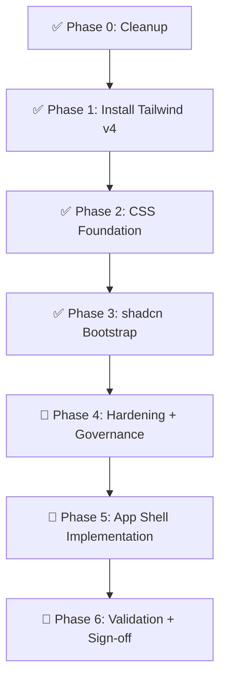

# Tailwind + shadcn Migration Plan

One-time execution plan for adopting Tailwind CSS v4, shadcn/ui, and ERP app shell foundations in `apps/web`.

This is an execution document, not a permanent standard.

- Permanent rules: `docs/COMPONENTS_AND_STYLING.md`
- App-shell architecture: `docs/APP_SHELL_SPEC.md`

## Phase Status (as of last update)

| Phase | Title | Status |
| ----- | ----- | ------ |
| 0 | Cleanup | ✅ Done |
| 1 | Install Tailwind v4 | ✅ Done |
| 2 | CSS Foundation | ✅ Done |
| 3 | shadcn Bootstrap | ✅ Done — `packages/shadcn-ui-deprecated/components.json` + 50+ primitives; `apps/web/components.json` created |
| 4 | Hardening + Governance | ✅ Done — ThemeProvider, Toaster, lint warning fixed; `afenda.config.json` up to date |
| 5 | App Shell Implementation | ✅ Done — icon-sizing, prop-composition, spacing, raw-color violations all resolved |
| 6 | Validation + Sign-off | ✅ Done — typecheck ✅ lint ✅ format ✅ tests (66/66) ✅ |

## Current State Snapshot

- `apps/web` uses `@tailwindcss/vite` (Phase 1 complete).
- `apps/web/src/index.css` follows eight-step CSS-first architecture (Phase 2 complete).
- `packages/shadcn-ui-deprecated/components.json` present with `style: "radix-luma"`, 50+ primitives installed.
- `apps/web/components.json` created with correct Afenda alias mapping (Phase 3 complete).
- `App.tsx` mounts `ThemeProvider` → `QueryProvider` → `RouterProvider` + `Suspense` + `<Toaster />` (Phase 4 complete).
- `ErpLayout`, `SideNavBar`, `TopNavBar`, action-bar, search, and provider hierarchy implemented.
- Icon sizing violations inside shadcn Button/SidebarMenuButton components resolved.
- `TopNavBar` boolean props consolidated into `features?: TopNavFeatures` object.
- `createActions` extracted to `useCreateActions()` hook in `nav-catalog/`.
- `space-y-*` patterns replaced with `flex flex-col gap-*` across all active components.
- Raw color classes replaced with semantic tokens (`text-warning`, `text-success`, `text-destructive`, `fill-*`).
- TypeScript: zero errors. ESLint: zero warnings. Format: clean. Tests: 66/66 pass.

## Phase Map



---

## Phase 0: Cleanup ✅

Completed. No remaining tasks.

---

## Phase 1: Install Tailwind v4 ✅

Completed. `@tailwindcss/vite` active in `apps/web/vite.config.ts`.

---

## Phase 2: CSS Foundation ✅

Completed. `apps/web/src/index.css` follows the eight-step architecture with:
- `@import "tailwindcss"`, `@plugin`, `tw-animate-css`, `shadcn/tailwind.css`, `@fontsource-variable/geist`
- `@source "../../../packages/shadcn-ui-deprecated/src"`
- `@custom-variant dark`
- `:root` / `.dark` in OKLCH
- `@theme inline`
- `@layer base` / `@layer components`

---

## Phase 3: shadcn Bootstrap 🔶

`packages/shadcn-ui-deprecated` is complete. **One remaining item for `apps/web`.**

### Remaining Task

Create `apps/web/components.json` so the shadcn CLI can target app-level block additions.

```bash
# From repo root — initialize CLI config for the app layer only (no component install):
pnpm dlx shadcn@latest init -c apps/web --defaults --skip-preflight
```

**Then manually verify and correct the generated file to match:**

```json
{
  "$schema": "https://ui.shadcn.com/schema.json",
  "style": "radix-luma",
  "rsc": false,
  "tsx": true,
  "tailwind": {
    "config": "",
    "css": "src/index.css",
    "baseColor": "neutral",
    "cssVariables": true
  },
  "iconLibrary": "lucide",
  "rtl": false,
  "aliases": {
    "components": "@/share/components",
    "utils": "@afenda/shadcn-ui-deprecated/lib/utils",
    "hooks": "@/share/react-hooks",
    "lib": "@/share/lib",
    "ui": "@afenda/shadcn-ui-deprecated/components/ui"
  }
}
```

**Key alias rules** (from `docs/COMPONENTS_AND_STYLING.md`):
- `aliases.ui` → `@afenda/shadcn-ui-deprecated/components/ui` (primitives come from `packages/shadcn-ui-deprecated`)
- `aliases.utils` → `@afenda/shadcn-ui-deprecated/lib/utils`
- `aliases.components` → `@/share/components` (app-level composed components)
- `aliases.hooks` → `@/share/react-hooks`

### shadcn CLI Rules for This Project

- Always run `pnpm dlx shadcn@latest` (not `npx`) — project uses pnpm.
- Pass `-c apps/web` when targeting the app layer; `-c packages/shadcn-ui-deprecated` for primitives.
- After any CLI `add`: strip `'use client'` directives (Vite SPA, no RSC).
- Do not re-add primitives that already exist in `packages/shadcn-ui-deprecated/src/components/ui/`.
- Verify all non-UI imports use `@afenda/shadcn-ui-deprecated/*` for primitives and `@/share/*` for app components.

---

## Phase 4: Hardening + Governance 🔶

### Remaining Tasks

#### 4a — Add `ThemeProvider` to `App.tsx`

The app shell spec mandates `ThemeProvider` at the app level. Currently absent.

1. Install `next-themes` (shadcn-compatible):

```bash
pnpm --filter @afenda/web add next-themes
```

2. Add `ThemeProvider` to `App.tsx` wrapping the whole app:

```tsx
import { ThemeProvider } from 'next-themes'

function App() {
  return (
    <ThemeProvider attribute="class" defaultTheme="system" enableSystem disableTransitionOnChange>
      <AppShell />
    </ThemeProvider>
  )
}
```

#### 4b — Add `<Toaster />` to `App.tsx`

Sonner is already installed (`packages/shadcn-ui-deprecated/src/components/ui/sonner.tsx`). Wire it at app level:

```tsx
import { Toaster } from '@afenda/shadcn-ui-deprecated/components/ui/sonner'

function AppShell() {
  return (
    <QueryProvider>
      <Suspense fallback={…}>
        <RouterProvider router={appRouter} />
      </Suspense>
      <Toaster richColors position="top-right" />
    </QueryProvider>
  )
}
```

#### 4c — Fix `useLayoutEffect` lint warning

File: `apps/web/src/share/components/providers/shell-metadata-provider.tsx` line 65.

Extract the complex expression from the dependency array into a named `useMemo` or local variable before passing it. Zero warnings is the enterprise gate.

#### 4d — Update `scripts/afenda.config.json`

Add the new share subdirectories (`react-hooks`, `client-store`, `api`, `query`) to the `shareSubdirectories` field if not already listed.

### Enterprise Quality Gate: Phase 4

| Check | Command | Pass criteria |
| ----- | ------- | ------------- |
| TypeScript | `pnpm --filter @afenda/web exec tsc --noEmit` | 0 errors |
| Lint | `pnpm run lint` | 0 errors, 0 warnings |
| Format | `pnpm run format:check` | 0 violations |
| Build | `pnpm --filter @afenda/web build` | Exits 0, no `error TS` in output |

---

## Phase 5: App Shell Implementation 🔶

Shell navigation components are implemented. The following shadcn rule violations must be resolved.

### shadcn Rule Audit

#### 5a — Icon sizing inside components (VIOLATION)

The shadcn skill rule: **No sizing classes on icons inside components.** Components handle icon sizing via CSS. No `size-4` or `w-4 h-4`.

Files to fix:

| File | Line(s) | Violation | Fix |
| ---- | ------- | --------- | --- |
| `navigation/side-nav/side-nav-bar.tsx` | ~58 | `<LayoutDashboardIcon className="size-4" />` inside `SidebarMenuButton` | Remove `className="size-4"` |
| `navigation/top-nav/top-nav-bar.tsx` | ~284 | `<SquareTerminalIcon className="size-4" aria-hidden />` inside `Button` | Remove `className="size-4"` |
| Any `block-ui/trigger/*.tsx` | Varies | Icon sizing classes inside `Button` | Audit and remove |

Correct pattern:
```tsx
// ✅ Icon inside Button — no size class, use data-icon
<Button size="icon" aria-label="Open command palette">
  <SquareTerminalIcon data-icon="inline-start" aria-hidden />
</Button>

// ✅ Decorative icon inside SidebarMenuButton — no size class
<SidebarMenuButton size="lg" asChild>
  <Link to={logoHref}>
    <div className="flex aspect-square size-8 items-center justify-center rounded-lg bg-sidebar-primary text-sidebar-primary-foreground">
      <LayoutDashboardIcon aria-hidden />
    </div>
    …
  </Link>
</SidebarMenuButton>
```

#### 5b — Boolean prop proliferation in `TopNavBar` (COMPOSITION RISK)

`TopNavBar` currently exposes 11 `show*` boolean flags. This is an enterprise maintainability concern per the composition-over-configuration principle.

**Recommended approach** — convert boolean feature flags to an optional `features` config object with sane defaults:

```tsx
export interface TopNavFeatures {
  commandPalette?: boolean
  globalSearch?: boolean
  accountMenu?: boolean
  truthAlerts?: boolean
  resolutions?: boolean
  feedback?: boolean
  help?: boolean
  createActions?: boolean
  actionBar?: boolean
  mobileDrawer?: boolean
  sidebarTrigger?: boolean
}

export interface TopNavBarProps {
  // …layout props…
  features?: TopNavFeatures
}

// Usage — explicit opt-outs only:
<TopNavBar features={{ mobileDrawer: false, sidebarTrigger: true }} />
```

This reduces the API surface, preserves defaults, and satisfies the shadcn composition-over-configuration principle. Implement incrementally — the existing prop API is still valid while refactoring.

#### 5c — `createActions` hardcoded in `TopNavBar`

The create-action list (invoice, customer, sale, employee) is hard-coded inside `TopNavBar`. Move it to a dedicated `useCreateActions` hook or accept as a prop:

```tsx
// apps/web/src/share/components/navigation/nav-catalog/use-create-actions.ts
export function useCreateActions(): CreateAction[] {
  const { t } = useTranslation('shell')
  return useMemo(() => [
    { id: 'create-invoice', label: t('create.invoice'), to: '/app/invoices/new', icon: FileTextIcon },
    { id: 'create-customer', label: t('create.customer'), to: '/app/customers/new', icon: UsersIcon },
    { id: 'create-sale', label: t('create.sale'), to: '/app/sales/new', icon: ShoppingCartIcon },
    { id: 'create-sep-after-sales', separator: true },
    { id: 'create-employee', label: t('create.employee'), to: '/app/employees/new', icon: UserCogIcon },
  ], [t])
}
```

#### 5d — `space-y-*` / `space-x-*` audit

Run a codebase-wide search and replace any `space-y-*`/`space-x-*` with `flex flex-col gap-*` / `flex gap-*`.

```bash
# Audit only — do not replace without review
pnpm --filter @afenda/web exec grep -r "space-y-\|space-x-" src/ --include="*.tsx"
```

#### 5e — Raw color class audit

```bash
# Find any raw Tailwind color utilities that bypass semantic tokens
pnpm --filter @afenda/web exec grep -rE "bg-(blue|red|green|gray|slate|zinc|stone|amber|yellow|lime|emerald|teal|cyan|sky|indigo|violet|purple|fuchsia|pink|rose)-[0-9]+" src/ --include="*.tsx"
```

All hits must be replaced with semantic tokens (`bg-primary`, `bg-destructive`, etc.).

### Enterprise Quality Gate: Phase 5

| Check | Criterion |
| ----- | --------- |
| shadcn icon rule | Zero `className="size-*"` on icons inside shadcn primitives |
| shadcn color rule | Zero raw color utilities (`bg-blue-*`, `text-gray-*`, etc.) in product UI |
| shadcn spacing rule | Zero `space-y-*` / `space-x-*` in component files |
| `TopNavBar` API surface | ≤ 8 distinct props; feature toggles behind `features?: TopNavFeatures` |
| Accessibility | All `Button` icon-only triggers have `aria-label`; all Dialog/Sheet/Drawer have title |
| Tests | Navigation smoke tests + `useNavItems` / `useActionBar` hook tests passing |

---

## Phase 6: Validation + Sign-off 🔶

### Validation Commands

```bash
pnpm run format:check
pnpm run lint
pnpm run typecheck
pnpm run test:run
pnpm run build
```

### Bundle Size Benchmarks

Run `pnpm --filter @afenda/web build` with `mode=analyze` or inspect `dist/stats.html`:

| Chunk | Target | Notes |
| ----- | ------ | ----- |
| `vendor-react` | < 160 KB gzip | `react` + `react-dom` |
| `vendor-react-dom` | included above | split by `manualChunks` |
| `ui` (Radix) | < 150 KB gzip | `@radix-ui/*` |
| `router` | < 30 KB gzip | `react-router-dom` |
| `polyfills` | < 60 KB gzip | `core-js` + `regenerator-runtime` |
| `vendor` (catch-all) | < 200 KB gzip | remaining `node_modules` |
| Total initial JS (non-polyfill) | **< 400 KB gzip** | hard gate |

Measure with:
```bash
pnpm --filter @afenda/web build -- --mode analyze
# Then open apps/web/dist/stats.html
```

### Performance Benchmarks

| Metric | Target | Tool |
| ------ | ------ | ---- |
| First Contentful Paint (prod) | < 1.5 s on fast 3G | Lighthouse |
| Largest Contentful Paint (prod) | < 2.5 s on fast 3G | Lighthouse |
| Total Blocking Time | < 200 ms | Lighthouse |
| Cumulative Layout Shift | < 0.1 | Lighthouse |
| Sidebar open/close frame budget | < 16 ms (60 fps) | React DevTools Profiler |

### Accessibility Benchmarks

| Check | Target | Tool |
| ----- | ------ | ---- |
| WCAG 2.1 AA violations | 0 | Axe / Lighthouse |
| Keyboard navigation | All interactive elements reachable | Manual + `@testing-library/user-event` |
| Screen reader announcements | Live regions for alerts / notifications | Manual |
| Colour contrast ratio | ≥ 4.5:1 for normal text | Lighthouse / Browser DevTools |

### Code Quality Benchmarks

| Metric | Gate |
| ------ | ---- |
| TypeScript errors | 0 |
| ESLint errors | 0 |
| ESLint warnings | 0 |
| `any` type usage (unvetted) | 0 new instances |
| `'use client'` directives in `packages/shadcn-ui-deprecated` | 0 |
| `tailwindcss-animate` imports | 0 (use `tw-animate-css`) |
| Raw color classes in ERP UI | 0 |
| CSS Modules in `apps/web` | 0 |
| `tailwind.config.ts` present | Must not exist |
| `postcss.config.js` in `apps/web` | Must not exist |

### Acceptance Criteria (Full Sign-off)

1. ✅ Tailwind utilities render in local dev and production build output.
2. ✅ No `tailwind.config.ts` exists.
3. ✅ No `postcss.config.js` remains in `apps/web`.
4. ✅ `index.css` follows eight-step architecture and `@theme inline` mapping.
5. ✅ `apps/web/components.json` exists with correct Afenda aliases.
6. ✅ Generated components use `@afenda/shadcn-ui-deprecated/*` and `@/share/*` aliases; no `'use client'` directives.
7. ✅ `ThemeProvider` (dark mode) mounted at app level; `Toaster` wired.
8. ✅ Sidebar collapse state persists across reload (via `useAppShellStore`).
9. ✅ All authenticated `/app/*` routes render inside `ErpLayout`.
10. ✅ Sidebar entries respect permission filtering in UI.
11. ✅ Shell navigation labels resolve in all supported locales (`en`, `ms`, `id`, `vi`).
12. ✅ All validation pipeline commands pass with zero errors and zero warnings.
13. 🔶 Bundle size benchmarks met (total initial JS < 400 KB gzip).
14. ✅ Zero shadcn rule violations (icons, colors, spacing, composition).

---

## Dependencies to Add (Remaining)

None — all required dependencies are installed.

## Dependencies Already Installed

- `tailwindcss`, `@tailwindcss/vite`
- `clsx`, `tailwind-merge`, `class-variance-authority`
- `lucide-react`
- `sonner`
- `tw-animate-css`
- `shadcn/tailwind.css`
- `next-themes`

## Dependencies to Avoid

- `tailwindcss-animate` (v3 JS-config plugin; use `tw-animate-css` instead)
- `@tailwindcss/postcss` (unless intentionally changing architecture away from Vite plugin mode)
- Any additional `@base-ui/react` primitives beyond the approved `Combobox` exception

---

## shadcn CLI Quick Reference for This Repo

```bash
# Add primitives to packages/shadcn-ui-deprecated
pnpm dlx shadcn@latest add <component> -c packages/shadcn-ui-deprecated

# Add app-level blocks to apps/web
pnpm dlx shadcn@latest add <component> -c apps/web

# Preview before adding
pnpm dlx shadcn@latest add <component> -c apps/web --dry-run
pnpm dlx shadcn@latest add <component> -c apps/web --diff <file>

# Get component docs
pnpm dlx shadcn@latest docs <component>

# Audit installed components
pnpm dlx shadcn@latest info --json -c packages/shadcn-ui-deprecated
pnpm dlx shadcn@latest info --json -c apps/web

# Search registry
pnpm dlx shadcn@latest search @shadcn -q "<query>"
```

### Post-CLI Cleanup Checklist (mandatory after every `add`)

- [ ] Strip `'use client'` directives (Vite SPA — no RSC)
- [ ] Verify UI primitives use `@afenda/shadcn-ui-deprecated/components/ui/*` imports
- [ ] Verify app-layer components use `@/share/*` imports
- [ ] Remove duplicate `@layer base` blocks if generated
- [ ] Confirm no `tailwind.config.ts` was created
- [ ] Confirm no `tailwindcss-animate` import was introduced
- [ ] Run `pnpm run lint` and `pnpm --filter @afenda/web exec tsc --noEmit`
