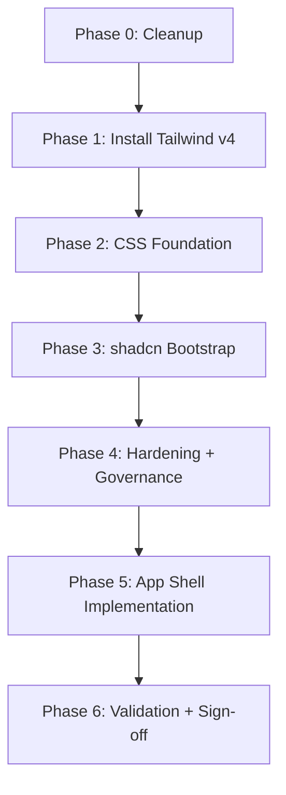

# Tailwind + shadcn Migration Plan

One-time execution plan for adopting Tailwind CSS v4, shadcn/ui, and ERP app shell foundations in `apps/web`.

This is an execution document, not a permanent standard.

- Permanent rules: `docs/COMPONENTS_AND_STYLING.md`
- App-shell architecture: `docs/APP_SHELL_SPEC.md`

## Current State Snapshot

- `apps/web` currently uses plain global/component CSS.
- `vite.config.ts` contains legacy `css.*` settings that conflict with Tailwind v4 plugin mode.
- `postcss.config.js` exists but is not needed for the v4 Vite path.
- Routes under `/app/*` are currently flat (no parent shell layout route).

## Phase Map



## Phase 0: Cleanup

### Tasks

- Remove `css.modules`, `css.postcss`, and unused preprocessor settings from `apps/web/vite.config.ts`.
- Delete `apps/web/postcss.config.js`.

### Expected file changes

- `apps/web/vite.config.ts`
- `apps/web/postcss.config.js` (delete)

## Phase 1: Install Tailwind v4

### Commands

```bash
pnpm --filter @afenda/web add -D tailwindcss @tailwindcss/vite
```

### Tasks

- Add `tailwindcss()` plugin to Vite plugins.
- Ensure plugin is active in the web package config.

### Expected file changes

- `apps/web/package.json`
- `apps/web/vite.config.ts`

## Phase 2: CSS Foundation

### Tasks

- Rewrite `apps/web/src/index.css` to the four-step CSS-first structure:
  1. `@import "tailwindcss"`
  2. root-level `:root` and `.dark` variables
  3. `@theme inline` mapping
  4. minimal `@layer base`
- Include required semantic token families, including sidebar/chart token groups.
- Add `@source` directives only if monorepo package scanning is needed.

### Expected file changes

- `apps/web/src/index.css`

## Phase 3: shadcn Bootstrap

### Commands

```bash
pnpm dlx shadcn@latest init -c apps/web
pnpm dlx shadcn@latest add button card input label separator badge sonner -c apps/web
pnpm dlx shadcn@latest add sidebar breadcrumb dropdown-menu avatar collapsible sheet tooltip skeleton -c apps/web
```

### Tasks

- Configure `components.json` to Afenda conventions (`rsc: false`, `base: "radix"`, `config: ""`, `@/share/*` aliases).
- Ensure `cn()` utility exists at `apps/web/src/share/lib/utils.ts`.
- Perform post-generation cleanup (imports, directives, duplicate CSS blocks).

### Expected file changes

- `apps/web/components.json`
- `apps/web/src/share/lib/utils.ts`
- `apps/web/src/share/components/ui/*`
- `apps/web/package.json`

## Phase 4: Hardening and Governance

### Tasks

- Add and mount `ThemeProvider` and root toaster integration.
- Update required share subdirectories in `scripts/afenda.config.json`.
- Align dependency docs to adopted status and references.

### Expected file changes

- `apps/web/src/share/providers/ThemeProvider.tsx`
- `apps/web/src/App.tsx`
- `scripts/afenda.config.json`
- `docs/dependencies/tailwind-v4.md`
- `docs/dependencies/shadcn-ui.md`

## Phase 5: App Shell Implementation

See `docs/APP_SHELL_SPEC.md` for architecture details.

### Tasks

- Implement `ErpLayout` route shell and refactor `/app/*` routes to nested layout pattern.
- Implement `AppSidebar`, `AppHeader`, `AppBreadcrumb`, and supporting layout components.
- Wire sidebar state to `useAppShellStore`.
- Add permission-gated nav rendering.
- Extend `shell.json` locale files with `nav.*` labels for `en`, `ms`, `id`, `vi`.
- Simplify `DashboardView` now that persistent shell navigation exists.

### Expected file changes

- `apps/web/src/share/routing/feature-routes.tsx`
- `apps/web/src/share/components/layout/*`
- `apps/web/src/features/dashboard/components/DashboardView.tsx`
- `apps/web/src/share/i18n/locales/*/shell.json`

## Phase 6: Validation and Sign-off

### Commands

```bash
pnpm run format:check
pnpm run lint
pnpm run typecheck
pnpm run test:run
pnpm run build
```

### Acceptance criteria (objective)

1. Tailwind utilities render in local dev and production build output.
2. No `tailwind.config.ts` exists.
3. No `postcss.config.js` remains in `apps/web`.
4. `index.css` follows four-step architecture and `@theme inline` mapping.
5. Generated components use `@/share/*` aliases and no `'use client'` directives.
6. Sidebar collapse state persists across reload.
7. All authenticated `/app/*` routes (except login) render inside shell layout.
8. Sidebar entries respect permission filtering in UI.
9. Shell navigation labels resolve in all supported locales.
10. Validation pipeline commands pass.

## Dependencies to Add

- `tailwindcss` (dev dependency)
- `@tailwindcss/vite` (dev dependency)
- `clsx`
- `tailwind-merge`
- `class-variance-authority`
- `lucide-react`
- `sonner`

## Dependencies to Avoid

- `tailwindcss-animate`
- `tw-animate-css`
- `@tailwindcss/postcss` (unless intentionally changing architecture away from Vite plugin mode)
