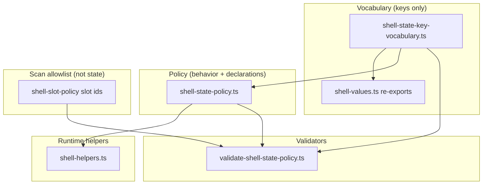

# Shell doctrine (`policy/shell`)

Monorepo-wide context: [Shell architecture](../../../../../../docs/SHELL_ARCHITECTURE.md).

Canonical **shell policy, contracts, registries, validators, runtime, and vocabulary** for the governed constant layer. Aligns to the live product (repo-first doctrine), not illustrative-only docs.

## Directory layout

| Subfolder / root files           | Role                                                                                                                                  |
| -------------------------------- | ------------------------------------------------------------------------------------------------------------------------------------- |
| `policy/`                        | `*-policy.ts` — governance doctrine, defaults, enforcement switches.                                                                  |
| `contract/`                      | `*-contract.ts` — Zod schemas and registration truth (metadata, components, slots, search).                                           |
| `registry/`                      | `*-registry.ts` — frozen key → row maps (`shellComponentRegistry`, slot contract by slot id).                                         |
| `validation/`                    | Validators, issue-code modules, and pure helpers (`shell-state-doctrine.ts` is re-exported via `validate-shell-state-policy.ts`).     |
| `runtime/`                       | `shell-provider.tsx`, hooks, selectors, `shell-helpers.ts` (no policy authoring).                                                     |
| `shell-state-key-vocabulary.ts`  | **Leaf** — canonical tuple + schema for governed **state keys** only.                                                                 |
| `shell-values.ts`                | **Barrel** — re-exports vocabulary tuples/schemas (zones, scopes, slots, overlays, search, state keys) + `ShellVocabulary` namespace. |
| `shell-doctrine-manifest.ts`     | JSON-stable manifest for baselines and tooling.                                                                                       |
| `index.ts`                       | Public **export surface** for this folder (see header JSDoc for layer order and validation pipeline).                                 |
| `SHELL_COMPONENTS_GUARDRAILS.md` | Enterprise matrix, phased build, Definition of Done.                                                                                  |

## Philosophy (repo-first doctrine)

Shell policy here is **aligned to the live product**, not copied from illustrative docs. The goal is a **high-value, low-risk** constant layer: explicit structure, strong validation, and inspectable reports—**without** breaking Phase 1 behavior (for example by forcing “reserved = empty” everywhere or renaming core fields for document parity).

**What we optimize for**

- **Explicit hierarchy:** occupant slots declare **`parentFrameSlot`** pointing at that zone’s structural `*.frame` slot; frame rows use **`parentFrameSlot: null`** (authored, not omitted—`null` is the sentinel).
- **Structural invariants** in `contract/shell-slot-contract.ts` (Zod): frame rows are not `multiEntry`, have exactly one `allowedComponentKinds` entry, required slots are `slotStatus: "active"`, and occupants resolve to the correct parent frame for their zone.
- **Registry-level diagnostics** in `validation/validate-shell-registry.ts`: parent frame exists, is a structural frame, matches zone, and is active—issue codes are phrased for CI and architecture review, not only schema errors.
- **Phase 1 reality:** `content.main` and `overlay.global` stay **active** with real registry mappings; **`overlay.command`** remains **reserved** until composition is primary. That preserves shipping truth while doctrine still records future intent.

**What we avoid**

- Renaming **`slotRole` / `slotStatus`** (clear in this repo; avoids churn).
- Adopting **doc-only component kinds** (e.g. `*_frame`, `search_launcher`) that do not match `contract/shell-component-contract.ts`.
- A blanket **`reserved_slot_has_registered_components`** rule: only valid if reserved is defined as “must have zero components” globally—**not** this Phase 1 model.

**Future (not authored yet)**

- Splitting **structural readiness** (`slotStatus`) from **population readiness** (e.g. derived **`isPopulated`** from registry/runtime) if product needs it—do not add parallel authored fields until necessary.

## Doctrine map (zones → frames → occupants)

Structural **frame** slots (`slotRole: "frame"`, `parentFrameSlot: null`) host chrome; **occupant** slots set `parentFrameSlot` to that zone’s `*.frame` id. Authoritative rows: `registry/shell-slot-registry.ts` (`shellSlotContractBySlotId`).

| Zone    | Frame slot (`required`) | Occupant slots (parent = zone frame)                                       |
| ------- | ----------------------- | -------------------------------------------------------------------------- |
| root    | `root.frame`            | —                                                                          |
| header  | `header.frame`          | `header.leading`, `header.breadcrumbs`, `header.center`, `header.trailing` |
| sidebar | `sidebar.frame`         | `sidebar.primary`, `sidebar.secondary`                                     |
| content | `content.frame`         | `content.banner`, `content.toolbar`, `content.main`                        |
| overlay | `overlay.frame`         | `overlay.global` (active), `overlay.command` (reserved)                    |

**Phase 1 `slotStatus`:** almost all slots are **active**; **`overlay.command`** is **reserved** (doctrine placeholder). This differs from illustrative docs that mark many slots reserved while still registering components—do not copy that blindly.

**Validators:** `validation/validate-shell-registry.ts` (includes **parent frame coherence**: e.g. `frame_parent_frame_slot_must_be_null`, `occupant_parent_frame_unknown`, `occupant_parent_frame_zone_mismatch`, `occupant_parent_frame_not_active`), `validation/validate-shell-policy-consistency.ts`, `validation/validate-shell-runtime-contracts.ts`; slot contracts are Zod-checked (`contract/shell-slot-contract.ts`).

## Naming conventions

- `*-policy.ts` — governance doctrine and enforcement switches.
- `*-contract.ts` — canonical truth contracts and registration schemas.
- `shell-state-key-vocabulary.ts` — **leaf** for state key strings + schema (import directly when avoiding unrelated barrels).
- `shell-values.ts` — **vocabulary barrel** (re-exports tuples/schemas; `ShellVocabulary` namespace for discoverability).
- Runtime: explicit filenames — `shell-provider.tsx`, `use-shell-metadata.ts`, `shell-selectors.ts`, `use-shell-selectors.ts`, `shell-helpers.ts`.

## Entry point (`index.ts`)

Use `index.ts` as the public shell export surface. Export order is normalized: **policy → contract → registry → validation → runtime → vocabulary + manifest**.

**Metadata namespaces (avoid barrel collisions):**

- **`ShellMetadataPolicyUtils`** — `policy/shell-metadata-policy.ts` (policy parse/defaults).
- **`ShellMetadataUtils`** — `contract/shell-metadata-contract.ts` (metadata shape parse/assert).

## Synchronization and serialized manifest

- **`shell-doctrine-manifest.ts`**: `getShellDoctrineManifest()` / `serializeShellDoctrineManifest()` — JSON-stable lists of component registry keys, slot ids, state keys, and validation pipeline name order (for baselines and tooling). Bump `SHELL_DOCTRINE_MANIFEST_VERSION` when the manifest shape changes.
- **State key leaf:** `shell-state-key-vocabulary.ts` (re-exported via `shell-values.ts`); policies should import the leaf when avoiding circular barrels.
- **Vocabulary barrel:** `shell-values.ts` re-exports zones, scopes, slot ids, overlay kinds, search scopes/result classes, and state keys; includes **`ShellVocabulary`** and **`ShellStateKeys`** for autocomplete.
- **Constant-layer validation order** (see `validate-constants.ts`): `validateShellRegistry` → `validateShellPolicyConsistency` → `validateShellStatePolicy` → `validateShellRuntimeContracts`. Optional narrow repo scan: `pnpm run script:check-shell-state-policy` (`validateShellStatePolicy({ scanRepo: true })`).

### Dependency diagram (shell state path)

Policies must not import `index.ts` when that would create cycles. The state-key leaf and validators depend downward only.

**Text summary:** `shellStateKeyValues` / schema → `shell-state-policy` (declarations) → `shell-helpers` (queries). `validate-shell-state-policy` reads vocabulary + policy (+ slot ids for literal scan); it does not import `shell-values.ts`. Pure doctrine: `validation/shell-state-doctrine.ts` (re-exported from `validate-shell-state-policy.ts`). Test-only dotted literal scan helper: `collectUndeclaredDottedLiteralIssuesFromSource`.

### Rules of thumb (reviewers)

- **Vocabulary** (`shell-state-key-vocabulary.ts`) is the only source of truth for **which strings** may be shell state keys.
- **Policy** (`shell-state-policy.ts`) must declare **every** vocabulary key **exactly once** (Zod + `validateShellStateDoctrine` enforce this).
- **Helpers** (`shell-helpers.ts`) only **query** policy/registry — they do not author new keys.
- **Validator** enforces doctrine (`validateShellStateDoctrine`) and optionally runs a **narrow regex scan** for stray dotted literals under shell doctrine paths. Regex is **interim**; a future **AST** pass should distinguish blessed APIs from unrelated strings.
- **Issue codes** for shell state validation live in `validation/shell-state-policy-issue-codes.ts` (`ShellStatePolicyIssueCode`).

### Scan ignore list (`DOTTED_LITERAL_FIRST_SEGMENT_IGNORE`)

If `script:check-shell-state-policy` flags a **false positive** in shell-ui / `policy/shell/runtime`, first confirm the string is not shell state. If it is a **non-shell** dotted key (e.g. another domain’s convention), add its **first segment** to the ignore set in `validate-shell-state-policy.ts` and document why in the PR. Prefer **narrow roots + AST** over growing this list indefinitely.

## Module responsibilities

### Core policies and contracts

- `policy/shell-policy.ts`: shell-wide runtime governance and anti-fork switches.
- `policy/shell-context-policy.ts`: required runtime providers and scope discipline.
- `contract/shell-metadata-contract.ts`: canonical shell metadata schema and defaults (helpers live in `shell-selectors.ts`). Exports **`ShellMetadataUtils`**.
- `policy/shell-metadata-policy.ts`: metadata field ownership vs contract shape. Exports **`ShellMetadataPolicyUtils`**.
- `contract/shell-component-contract.ts`: shell component participation/dependency registry.
- `registry/shell-component-registry.ts`: stable key → contract map.

### Shell component contract versioning (v1 entry vs v2 blueprint)

**Today (authoritative):** `shellComponentContractEntrySchema` validates each entry (including `superRefine`). Participation modes live under a nested **`participation`** object (`shellParticipationSchema`: `shellMetadata`, `navigationContext`, `commandInfrastructure`, `layoutDensity`, `responsiveShell`). The repo also defines **`ShellParticipationContractV2Blueprint`** and **`shellComponentContractEntryToV2Blueprint`** — a **higher-level grouping** (`identity`, `boundary`, `participation`, `placement`, `policy`) for forward-looking APIs; it does **not** add a second Zod parse path or replace entry validation.

**Not implemented yet:** a **`contractVersion`**-keyed **`discriminatedUnion`** (v1 | v2), runtime v2 parsing, or wire-format migration. Record that here so future bumps are intentional.

**Benefits of a full migration** (when you actually version the contract):

- **Explicit evolution:** a version tag makes v1 vs v2 a first-class fact for parsers, logs, and migrations (no guessing from object shape).
- **Dual-shape rollout:** accept both shapes during transition; retire v1 after cutover.
- **Clearer boundaries:** grouped fields (`identity`, `boundary`, `participation`, `placement`, `policy`) reduce “where does this field live?” mistakes as the contract grows.
- **Fewer accidental breaking changes:** additive changes can target the right group; flat-only objects tend to sprawl.
- **Stronger CI:** one Zod surface for v2 invariants (including rules currently in `superRefine`) once you choose to validate grouped payloads at runtime.

**Costs / reasons to defer:**

- Migration work: dual paths, tests, registry/manifest/governance updates, and a deprecation window.
- Extra churn if only TypeScript and a single writer consume the contract today.

**When it tends to pay off:** multiple producers or consumers (CLI, backend, other apps), **serialized** payloads that must stay compatible across versions, or **non-TypeScript** consumers — that is when `discriminatedUnion` and explicit `parseV1 → v2` pipelines earn their keep.

**Until then:** the v2 **interface + mapper** already documents the target shape for TypeScript callers without paying migration cost.

**Optional DX:** an alias such as `parseShellComponentContractV1EntryToV2Blueprint` (same function as `shellComponentContractEntryToV2Blueprint`) is naming-only; add if call sites prefer “parse” wording.

### Phase 1 enterprise doctrine (composition and platform behavior)

- `policy/shell-slot-policy.ts`: canonical slots, component→slot mapping, singleton rules.
- `policy/shell-layout-policy.ts`: region scroll/sticky behavior and layout guarantees.
- `policy/shell-tenant-context-policy.ts`: tenant resolution, switching, invalidation doctrine.
- `policy/shell-workspace-context-policy.ts`: workspace binding and rebasing doctrine.
- `policy/shell-state-policy.ts`: shell state declarations (domain, persistence, isolation, resets) and vocabulary alignment.
- `policy/shell-overlay-policy.ts`: overlay kinds, stacking, and focus discipline.
- `policy/shell-search-policy.ts`: search scope, registration, and result taxonomy.

### Phase 1.5 / P2 policies

- `policy/shell-navigation-policy.ts`, `policy/shell-access-policy.ts`, `policy/shell-command-policy.ts`, `policy/shell-failure-policy.ts`.
- `policy/shell-responsiveness-policy.ts`, `policy/shell-observability-policy.ts`.

### Validators

- `validation/validate-shell-registry.ts`: registry integrity, slot mapping, singleton slot rules, slot contract vs policy alignment, **`parentFrameSlot` coherence** (registry issue codes for CI).
- `validation/validate-shell-policy-consistency.ts`: cross-policy consistency (layout vs slots, tenant/workspace, overlay/search).
- `validation/validate-shell-state-policy.ts`: state vocabulary ↔ declarations; optional narrow repo literal scan; re-exports state doctrine + issue codes.
- `validation/validate-shell-runtime-contracts.ts`: registry vs search/overlay/metadata expectations.

### Runtime consumption

- `runtime/shell-provider.tsx`: canonical metadata provider boundary.
- `runtime/use-shell-metadata.ts`: strict/optional shell metadata hook surface.
- `runtime/shell-selectors.ts`: typed shell semantic selectors.
- `runtime/use-shell-selectors.ts`: convenience hooks on top of canonical provider.
- `runtime/shell-helpers.ts`: slot lookups including **`getParentFrameSlotForSlotId`**.

### Guardrails

- [`SHELL_COMPONENTS_GUARDRAILS.md`](./SHELL_COMPONENTS_GUARDRAILS.md): enterprise matrix, phased build, Definition of Done.

## Usage principles

- Prefer `ShellProvider` + `useShellMetadata` over local shell contexts.
- Prefer selector helpers/hooks over repeated direct string comparisons.
- Do not export or consume a raw shell context object outside `shell-provider.tsx`.
- Keep feature-level shell reinvention blocked by policy and governance checks.

## Governance CLI

- Refresh [`SHELL_COMPONENTS_GUARDRAILS.md`](./SHELL_COMPONENTS_GUARDRAILS.md) Current Status table from registry:
  - `pnpm run script:generate-shell-components-guardrails`
- Local shell report command:
  - `pnpm run script:check-shell-governance-report`
- JSON output mode (used by CI and automation):
  - `pnpm run script:check-shell-governance-report -- --format=json`
- **Cross-artifact view:** versioned JSON reports and the default text output include **`slotDoctrineMatrix`**—one inspectable table of slot id, zone, `slotRole`, `slotStatus`, `parentFrameSlot`, required, multi-entry, allowed kinds, **registry owners** (keys from `componentToSlot`), and **child occupant slot ids** listed on each frame row.
- Shell state doctrine + optional scan (not part of `script:ui-drift-governance`):
  - `pnpm run script:check-shell-state-policy`
- UI drift + shell governance report + ast-grep (does **not** run shell state policy scan by default):
  - `pnpm run script:ui-drift-governance`

## Report artifacts (versioned)

The shell governance report script writes JSON artifacts to:

- `.artifacts/reports/shell-governance/shell-governance-report.vNNNN.json` (incrementing snapshot)
- `.artifacts/reports/shell-governance/shell-governance-report.latest.json` (latest pointer)
- `.artifacts/reports/shell-governance/shell-doctrine-manifest.vNNNN.json` and `shell-doctrine-manifest.latest.json` — same version counter; contents from `serializeShellDoctrineManifest(true)` (registry keys, slot ids, state keys, validation pipeline names)

Each run increments the version number (`v0001`, `v0002`, …), so shell governance evidence stays auditable over time.

## Tests (Vitest, `apps/web`)

Representative governance tests under `apps/web/src/share/__test__/`: `shell-doctrine-manifest.test.ts`, `shell-values.test.ts`, `shell-state-key-vocabulary.test.ts`, `validate-shell-state-policy.test.ts`, `shell-state-doctrine.test.ts`, `shell-registry.test.ts`, `shell-policy-consistency.test.ts`, `shell-runtime-contracts.test.ts`, plus component contract tests. Run: `pnpm --filter @afenda/web test:run` (or targeted `vitest run` paths).

## CI integration

The CI workflow runs:

- `pnpm run script:check-shell-governance-report -- --format=json`

And uploads:

- `.artifacts/reports/shell-governance/*.json`

as a build artifact named `shell-governance-report`.
